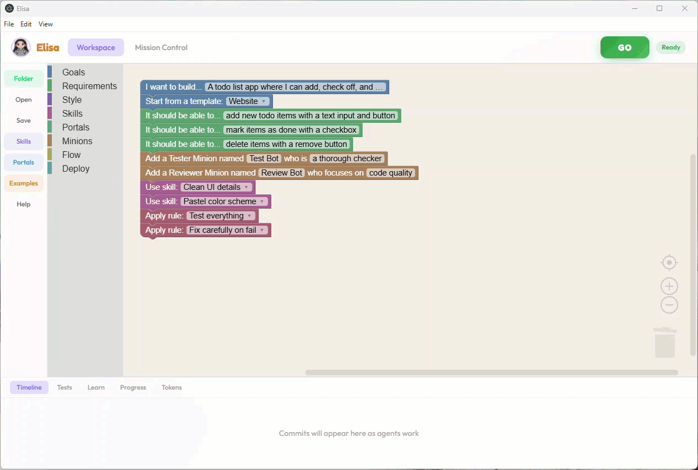

<p align="center">
  
</p>

<h1 align="center">Elisa</h1>

<p align="center">
  A block-based visual programming environment where kids (and adults) design software by snapping blocks together, then AI agents build it.
</p>

<p align="center">
  
  
  
  
  
</p>

---

<p align="center">
  
</p>

## What is Elisa?

Elisa is an educational tool that turns block-based visual programming into real working software. Users drag and drop blocks to describe what they want -- goals, features, constraints, visual style, hardware targets -- and a team of AI agents collaborates to build it. The entire process is visible: you watch agents plan, code, test, and deploy in real time.

## Quick Start

**Prerequisites:** Node.js 20+, an Anthropic API key (`ANTHROPIC_API_KEY` env var). Optional: Python 3.10+ with `mpremote` for ESP32 flashing, `gcloud` CLI for Cloud Run deployment.

```bash
npm install              # installs root + backend + frontend deps
npm run dev:electron     # launches backend, frontend, and Electron window
```

This is an Electron desktop app -- `dev:electron` is the primary dev command. For browser-only development (no Electron window):

```bash
npm run dev              # backend (port 8000) + frontend (port 5173)
```

See [Getting Started](docs/getting-started.md) for full setup. Tested on Windows and macOS.

## Features

**Block-Based Design** -- Snap together blocks across 9 categories to describe your project: goals, requirements, style, agents, flow control, hardware, deployment, skills, and rules. No code required.

**AI Agent Orchestration** -- A meta-planner decomposes your spec into a task DAG. Builder, tester, reviewer, and custom agents execute tasks with dependency ordering, retries, and inter-agent communication.

**Live Build Visibility** -- Watch the build in a three-pane layout: block editor (left), mission control with task graph and agent comms (right), and a bottom bar with git timeline, test results, serial output, and teaching moments.

**Hardware Integration** -- Target ESP32 boards directly via the device plugin system. Built-in plugins for Heltec WiFi LoRa V3/V4 (sensor nodes, gateways with LoRa + OLED), LED blink, and cloud dashboards. Auto-detect, compile, and flash over USB. See [Creating Device Plugins](docs/creating-device-plugins.md).

**IoT Sensor Networks** -- Build multi-device IoT systems: sensor nodes with DHT22/reed switch/PIR sensors communicate via LoRa radio to gateway nodes that relay data over WiFi to Google Cloud Run dashboards.

**Human-in-the-Loop** -- Insert "check with me" gates at any point. Agents pause and ask for approval before continuing. Answer agent questions mid-build.

**Teaching Moments** -- A teaching engine surfaces age-appropriate explanations of programming concepts as agents work, turning every build into a learning session.

**Skills and Rules** -- Create reusable prompt snippets (skills) and trigger-based rules that shape agent behavior across builds.

**Portals** -- Connect agents to external systems via MCP servers, CLI tools, and hardware serial I/O.

## Agentic Spec-Driven Development

Elisa is an IDE for **agentic spec-driven development** -- a paradigm where the artifacts the software creator cares about are the **specs and the tests**, not the code. Users define *what* they want through visual blocks; AI agents figure out *how* to build it. The code is a generated artifact, like a compiled binary.

Every block in the IDE maps to a real AI engineering primitive:

| Elisa Primitive | Block Examples | AI Engineering Concept |
|---|---|---|
| **Goal** | `nugget_goal`, `nugget_template` | Top-level system prompt. The root instruction that drives the entire agent pipeline. |
| **Requirement** | `feature`, `constraint`, `when_then`, `has_data` | Prompt constraints and acceptance criteria. Decomposed by the meta-planner into the task DAG. |
| **Skill** | `use_skill` | Reusable prompt snippets injected into agent context. Multi-step flows with branching (ask user, run agent, invoke another skill). |
| **Rule** | `use_rule` | Pre/post hooks on agent behavior. Trigger-based constraints that fire on events like `before_commit` or `on_test_fail`. |
| **Portal** | `portal_tell`, `portal_when`, `portal_ask` | Tool use: MCP servers, CLI commands, hardware serial I/O. Portals are the agent's hands -- how it reaches the outside world. |
| **Minion** | `agent_builder`, `agent_tester`, `agent_reviewer`, `agent_custom` | Specialized agent roles with distinct system prompts, tool access, and token budgets. Custom minions let users define new roles. |
| **Flow** | `first_then`, `at_same_time`, `check_with_me` | DAG dependencies, parallel execution, and human-in-the-loop gates. Controls the orchestration topology. |
| **Deploy** | `deploy_web`, `deploy_esp32`, `deploy_both` | Deployment targets. Web deploys locally or to Cloud Run; hardware compiles and flashes MicroPython over USB. |

The visual block workspace compiles to a **NuggetSpec** -- a Zod-validated JSON schema that is the single source of truth. The orchestrator consumes the spec, the meta-planner decomposes it into tasks, and agents execute against it. Users iterate on the spec and re-run; the code regenerates.

## Architecture

```
Electron Shell (main.ts)
  |
  +-- Browser (React SPA)  <──REST + WebSocket──>  Express Server
        |                                               |
    Blockly Editor                              Orchestrator Pipeline
    Mission Control                         PlanPhase -> ExecutePhase
    Bottom Bar                              TestPhase -> DeployPhase
                                            AgentRunner (Claude Agent SDK)
                                            GitService, TestRunner
                                            HardwareService, DeviceRegistry
                                            TeachingEngine, NarratorService
```

Four-phase pipeline: **plan** (meta-planner decomposes spec into task DAG) -> **execute** (up to 3 agents run in parallel via streaming Promise.race pool) -> **test** (pytest/node test runner) -> **deploy** (web preview, device flash, or cloud deploy).

Each agent runs as an isolated SDK `query()` call. No database -- all session state is in-memory with optional JSON persistence for crash recovery. See [ARCHITECTURE.md](ARCHITECTURE.md) for the full system design.

## Project Structure

```
elisa/
  frontend/          React 19 + Vite + Blockly SPA
    src/components/
      BlockCanvas/   Blockly editor + block definitions + interpreter
      MissionControl/ Task DAG, agent comms feed, narrator, metrics
      BottomBar/     Git timeline, test results, board output, teaching
      shared/        GoButton, modals, toasts, avatars, flash wizard
      Skills/        Skills CRUD editor + visual flow editor
      Rules/         Rules CRUD editor + template library
      Portals/       Portals CRUD editor + registry
  backend/           Express 5 + WebSocket server
    src/services/
      orchestrator   Build pipeline controller
      agentRunner    Claude Agent SDK runner
      metaPlanner    NuggetSpec -> task DAG decomposition
      gitService     Per-session git repo management
      testRunner     pytest / node test execution + coverage
      hardwareService ESP32 detect/compile/flash/serial
      deviceRegistry Device plugin manifest loader
      cloudDeployService Google Cloud Run deployment
      teachingEngine Concept curriculum and deduplication
      narratorService Build event narration (Claude Haiku)
      skillRunner    Multi-step skill execution engine
      portalService  MCP + CLI portal adapters
  devices/           Device plugin system
    _shared/         Common MicroPython libs (LoRa driver, board abstraction)
    heltec-sensor-node/  DHT22/reed/PIR sensor with LoRa TX
    heltec-gateway/      LoRa RX + WiFi relay + OLED display
    cloud-dashboard/     Google Cloud Run dashboard scaffold
    heltec-blink/        Simple LED blink example
  electron/          Electron main process + IPC bridge
  docs/              Documentation (see below)
```

## Documentation

- [Getting Started](docs/getting-started.md) -- Prerequisites, install, first build
- [User Manual](docs/manual/README.md) -- Complete guide to using Elisa
- [Architecture](ARCHITECTURE.md) -- System-level design overview
- [API Reference](docs/api-reference.md) -- REST endpoints, WebSocket events, NuggetSpec schema
- [Block Reference](docs/block-reference.md) -- Complete block palette guide
- [Device Plugins](docs/device-plugins.md) -- Device plugin system overview
- [Creating Device Plugins](docs/creating-device-plugins.md) -- Guide to building new device plugins
- [Master Index](docs/INDEX.md) -- Full directory map, doc map, and key source files

## Environment Variables

| Variable | Required | Default | Description |
|----------|----------|---------|-------------|
| `ANTHROPIC_API_KEY` | Yes | -- | Claude API key for agent execution |
| `CLAUDE_MODEL` | No | `claude-opus-4-6` | Model for builder/tester/reviewer agents |
| `NARRATOR_MODEL` | No | `claude-haiku-4-5-20241022` | Model for narrator messages |
| `PORT` | No | `8000` | Backend server port |
| `CORS_ORIGIN` | No | `http://localhost:5173` | CORS origin for dev mode |

## License

[MIT](LICENSE) -- (c) 2026 Zoidberg
